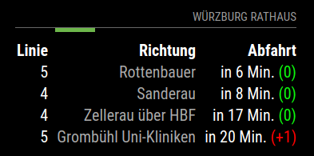
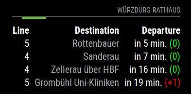

# MMM-BFA
Departure monitor for the local public transport (ÖPNV) of Bavaria.

The data is fetched from [bayern-fahrplan.de](https://bayern-fahrplan.de "Bayern Fahrplan"), the distributor for public transport data in Bavaria.
The module scrapes the departure data without requiring any API key or special permission and offers a bunch of options you can play around with. Feel free to contribute!

The structure and layout of this MagicMirror module was inspired by [MMM-KVV](https://github.com/yo-less/MMM-KVV "Karlsruhe Public Transport").

## Screenshots

German (1):<p>
<p>
German (2):<p>
<p>
English:<p>
<p>
English (2):<p>


## Languages
MMM-BFA features language support for `German (de)` and `English (en)` mirrors.

## Prerequisite
A working installation of [MagicMirror<sup>2</sup>](https://github.com/MichMich/MagicMirror).

## Dependencies
  * npm
  * [request](https://www.npmjs.com/package/request)
  * [cheerio](https://www.npmjs.com/package/cheerio)
  
## Installation
1. Navigate into your MagicMirror's modules folder.
2. Execute git clone https://github.com/sebikolon/MMM-BFA.git.
3. Execute cd MMM-BFA.
4. Execute `npm install`.

## Module behavior
Please note that this module **auto-creates a module header** which displays the text that was defined in the module settings. It is therefore recommended not to add a 'header' entry to your config.js for this module.<P>
There is a **progress loading bar** displayed that runs from the left to the right side of the module border, indicating when the next data refresh is performed. You can adjust the color of this loading bar in the module config. In order to adjust the look-and-feel more granular, add an override to the CSS identifiers `.MMM-BFA #divReload` and `.MMM-BFA #divReloadWrapper`.<P>
The **delay** of an upcoming trip is marked in red color (if there is any), otherwise in green color. If defined, additional trip information like *Trip cancelled* will be shown instead of the delay.<P>
This module has been programmed to allow for **multiple instances**. Simply add more MMM-BFA config entries to your config.js file to display multiple stations and configure them according to your needs.

## Configuration
You can show the MMM-BFA module without setting any configuration options.<BR>In this case, the stop `Regensburg University` is set as default *stop_from_ID*.

Sample configuration entries for your `~/MagicMirror/config/config.js` with optional parameters:

* To show departures of a single trip (**from** a stop **to** another stop):

    ```
    ...
    {
        module: 'MMM-BFA',
        position: 'bottom_left',
        config: {
            updateInterval :    30 * 1000,
            stop_from_ID:       4014080,
            stop_to:            ["Klinikum", "Roter-Brach-Weg"],
            maximumTripsToShow: 10,
            titleText :         "Universität Regensburg"  
        }
    }       // If this isn't your last module, add a comma after the bracket
    ...
    ```

* To show all departures from a stop omit the *stop_to* entry:

    ```
    ...
    {
        module: "MMM-BFA",
        position: "top_right",
        config: {
            updateInterval :    30 * 1000,
            stop_from_ID:       3700440,
            maximumTripsToShow: 4,
            titleText :         "Rathaus Würzburg"
        }
    }        // If this isn't your last module, add a comma after the bracket7
    ...
    ```

## How to get the correct stopID
1. Open your web browser and navigate to the [the txt version of bayern-fahrplan.de](https://txt.bayern-fahrplan.de/textversion/bcl_abfahrtstafel).
2. Click on "Abfahrtsmonitor anfordern" to reveal a search field.
3. Write the name of your stop (e.g. Regensburg Universität) and press enter
4. Choose the right stop if more than one stop is found with your keywords (N.B. only choose actual stops, labeled with "[Haltestelle]").
5. Click on "Abfahrtsmonitor anfordern" to show the next departures from that stop.
6. Once the departures are shown, look at the source code of the page (e.g. in Firefox: right click -> View Page Source)
7. Search the name of the stop in the source code. The stopID (7-digit number) is indicated e few characters after it, right after ```value=```. For example, for "Regensburg Universität" (stopID 4014080) we'll have: ``` <b>Regensburg Universität<span class="odvDesc"> [Haltestelle]</span><input type="hidden" name="name_dm" value="4014080"/> ```.


## Config Options
| **Option** | **Default** | **Description** |
| :---: | :---: | --- |
| stop_from_ID | 4014080 |<BR>Which stop would you like to have displayed? <BR><EM> Default: University Regensburg</EM><P> |
| stop_to<BR>`optional`       | []      |<BR>Which directions do you want to include into your trip list?<BR>Put the names of the stops into the array, separated by comma<BR><EM>Default: Show all directions </EM><P> |
| maximumTripsToShow<BR>`optional`       | 5      |<BR>How many trips to you want to show in total (including all directions)?<BR>This is a maximum value. Probably there are less trips available then desired<P> |
| logToConsole<BR>`optional`       | false      |<BR>Turn on the log onto the console (for debugging purposes)<BR><P> |
| progressColor<BR>`optional`       | #6db64b      |<BR> Default color name (or RGB code) of the progress bar<BR><EM>Default: light green</EM><P> |
| updateInterval<BR>`optional` | 30 * 1000 | <BR>How often should the trip data be refreshed (in milliseconds)?<BR><EM> Default: Every 30 seconds </EM><P> |
