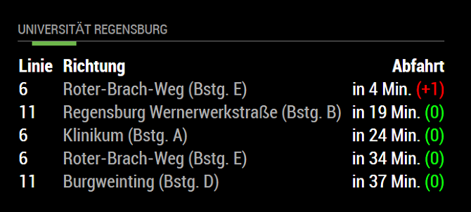
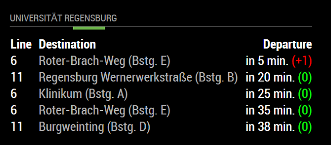

# MMM-RVV
Departure monitor for the [**RVV (Regensburger Verkehrsverbund)**](https://rvv.de "RVV Homepage") train and bus system (ÖPNV / public transport).

The data is fetched from [bayern-fahrplan.de](https://bayern-fahrplan.de "Bayern Fahrplan"), the distributor for public transport data in bavaria.
The reason for the development of this open source module is because the official API provided by them requires the signage of a personalized contract in order to gain access to their endpoints. The module scrapes the departure data without requiring any API key or special permission and offers a bunch of options you can play around with. Feel free to contribute!

The structure and layout of this MagicMirror module was inspired by [MMM-KVV](https://github.com/yo-less/MMM-KVV "Karlsruhe Public Transport").

## Screenshots

## Languages
MMM-RVV features language support for `German (de)` and `English (en)` mirrors.

## Prerequisite
A working installation of [MagicMirror2](https://github.com/MichMich/MagicMirror).

## Dependencies
  * npm
  * [request](https://www.npmjs.com/package/request)
  * [cheerio](https://www.npmjs.com/package/cheerio)
  
## Installation
1. Navigate into your MagicMirror's modules folder.
2. Execute git clone https://github.com/sebikolon/MMM-RVV.git.
3. Execute cd MMM-RVV.
4. Execute `npm install`.

## Module behavior
Please note that this module **auto-creates a module header** which displays the text that was defined in the module settings. It is therefore recommended not to add a 'header' entry to your config.js for this module.

There is a **progress loading bar** displayed that runs from the left to the right side of the module border, indicating when the next data refresh is performed. You can adjust the color of this loading bar in the module config. In order to adjust the look-and-feel more granular, add an override to the CSS identifiers `.MMM-RVV #divReload` and `.MMM-RVV #divReloadWrapper`.

This module has been programmed to allow for **multiple instances**. Simply add more MMM-RVV config entries to your config.js file to display multiple stations and configure them according to your needs.

## Configuration
You can show the MMM-RVV module without setting any configuration options. In this case, the stop `Regensburg University` is set as default *stop_from_ID*.

Sample configuration entry for your `~/MagicMirror/config/config.js` with optional parameters:

    ...
    
    {
        module: 'MMM-RVV',
        position: 'bottom_left',
        config: {
            updateInterval :    30 * 1000,
            stop_from_ID:       4014080,
            stop_to:            ["Klinikum", "Roter-Brach-Weg"],
            maximumTripsToShow: 10,
            titleText :         "Universität Regensburg"  
        }
    }       // If this isn't your last module, add a comma after the bracket
    
    ...

## How to get the correct stopID
1. Open your web browser and navigate to the [bayern-fahrplan.de stop list](https://www.bayern-fahrplan.de/XML_COORD_REQUEST?&jsonp=jQuery17203101277124009285_1524132000786&boundingBox=&boundingBoxLU=11.953125%3A49.15297%3AWGS84%5BDD.DDDDD%5D&boundingBoxRL=12.304688%3A48.922499%3AWGS84%5BDD.DDDDD%5D&coordOutputFormat=WGS84%5BDD.DDDDD%5D&type_1=STOP&outputFormat=json&inclFilter=1&_=1524132001290).
2. Use the search field to find the stop name you are interested in (e.g. 'Universität').
3. If found, search within the json record for "id" (a 6-8 digit number), this is the `stop_from_ID` you are looking for.

## Config Options
| **Option** | **Default** | **Description** |
| :---: | :---: | --- |
| stop_from_ID | 4014080 | Which stop would you like to have displayed?  <EM> Default: University Regensburg</EM>
 |
| stop_to `optional`       | []      | Which directions do you want to include into your trip list? Put the names of the stops into the array, separated by comma. <EM>Default: Show all directions </EM>
 |
| maximumTripsToShow `optional`       | 5      | How many trips to you want to show in total (including all directions)? This is a maximum value. Probably there are less trips available then desired.
 |
| logToConsole `optional`       | false      | Turn on the log onto the console (for debugging purposes) 
 |
| progressColor `optional`       | #6db64b      |  Default color name (or RGB code) of the progress bar <EM>Default: RVV (Regensburger Verkehrsverbund) CI color (light green)</EM>
 |
| updateInterval `optional` | 30 * 1000 |  How often should the trip data be refreshed (in milliseconds)? <EM> Default: Every 30 seconds </EM>
 |
